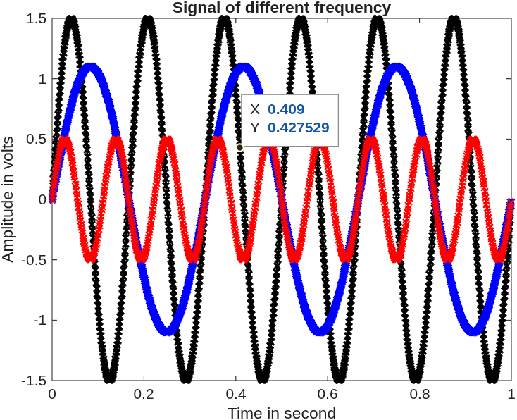
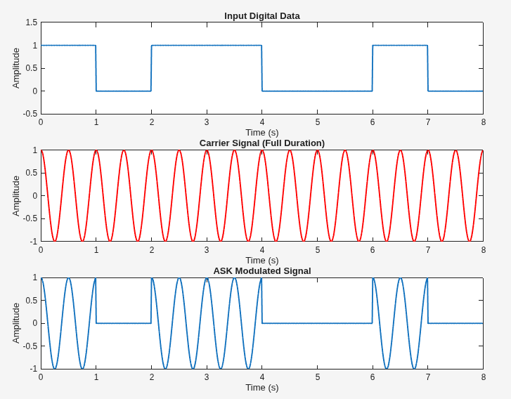
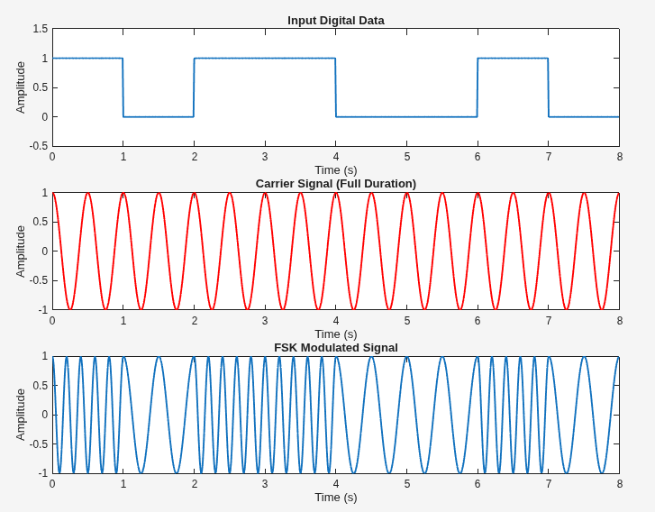
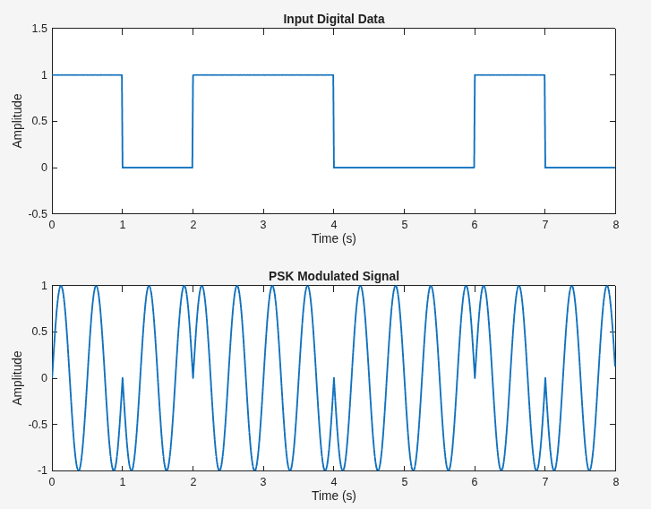
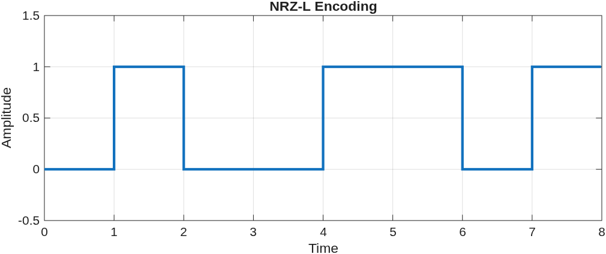
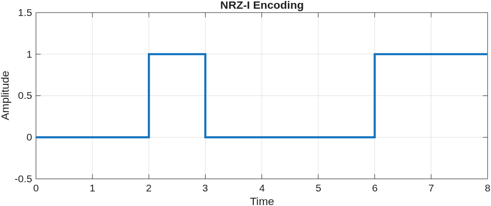
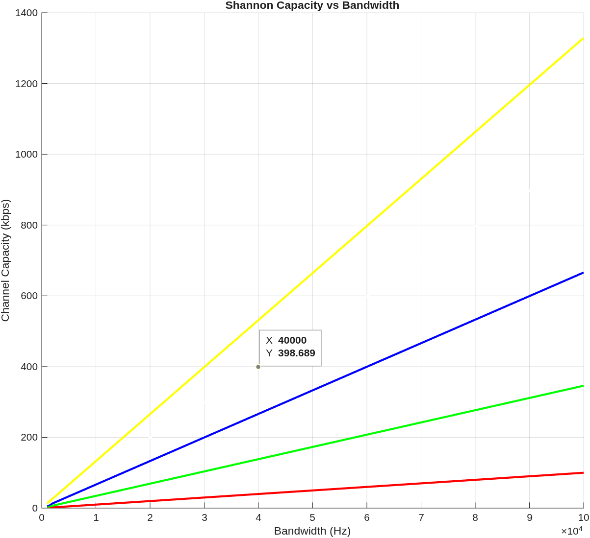
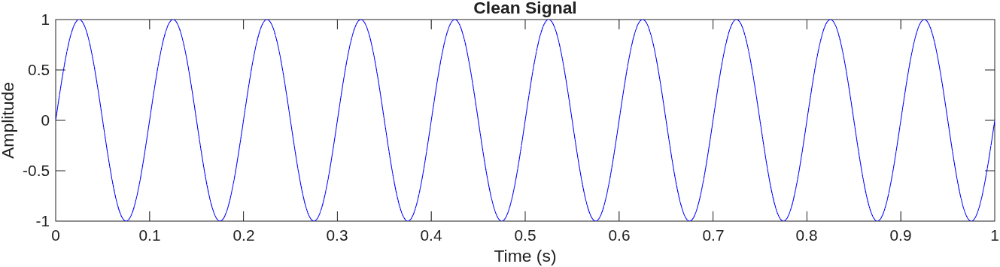
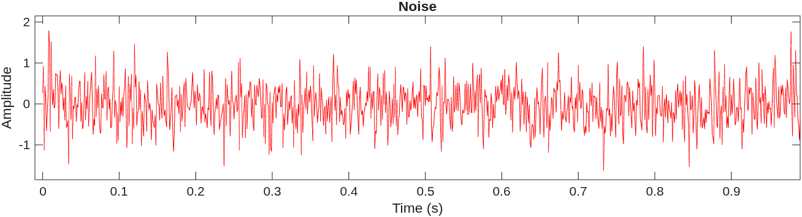
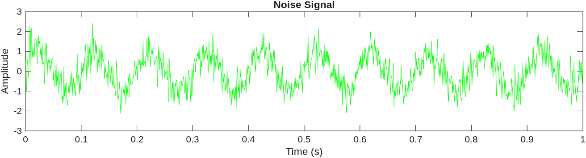

# MATLAB Digital Communication & Signal Processing

This repository contains MATLAB implementations of various digital communication and signal processing techniques. Each script demonstrates fundamental concepts with visualizations.

## 📁 Contents

### 1. **Signal Generation** (`signal.m`)
Demonstrates the generation and visualization of multiple sinusoidal signals with different frequencies and amplitudes.

**Key Logic:**
- Creates three sine waves with different frequencies (3Hz, 6Hz, 9Hz) and amplitudes (1.1V, 1.5V, 0.5V)
- Uses a sampling frequency of 1000 Hz for accurate signal representation
- Plots all signals together to show frequency and amplitude relationships



---

### 2. **Digital Modulation Techniques**

#### 2.1 ASK - Amplitude Shift Keying (`ask.m`)
Implements binary ASK modulation where digital data modulates the amplitude of a carrier signal.

**Key Logic:**
- Binary '1' → Full amplitude carrier signal
- Binary '0' → Zero amplitude (no signal)
- Carrier frequency: 2 Hz
- Bit rate: 1 bps
- Sampling frequency: 100 Hz



#### 2.2 FSK - Frequency Shift Keying (`fsk.m`)
Implements binary FSK modulation where digital data modulates the frequency of a carrier signal.

**Key Logic:**
- Binary '1' → High frequency carrier (5 Hz)
- Binary '0' → Low frequency carrier (2 Hz)
- Uses two different carrier frequencies to represent binary data
- Maintains constant amplitude throughout



#### 2.3 PSK - Phase Shift Keying (`psk.m`)
Implements binary PSK (BPSK) modulation where digital data modulates the phase of a carrier signal.

**Key Logic:**
- Binary '1' → 0° phase (normal sine wave)
- Binary '0' → 180° phase (inverted sine wave)
- Carrier frequency: 2 Hz
- Phase difference represents the binary data



---

### 3. **Line Coding Schemes** (`nrzl_nrzi.m`)
Demonstrates two Non-Return-to-Zero (NRZ) encoding techniques used in digital data transmission.

**Key Logic:**

**NRZ-L (Non-Return-to-Zero Level):**
- Binary '1' → Low voltage (0V)
- Binary '0' → High voltage (1V)
- Direct mapping of bit value to voltage level

**NRZ-I (Non-Return-to-Zero Inverted):**
- Binary '1' → Transition (toggle state)
- Binary '0' → No transition (maintain state)
- Changes occur at bit boundaries only for '1' bits




---

### 4. **Shannon Capacity Theorem** (`shannon.m`)
Visualizes Shannon's Channel Capacity theorem which defines the theoretical maximum data rate of a communication channel.

**Key Logic:**
- Formula: `C = B × log₂(1 + SNR)`
  - C = Channel capacity (bits/second)
  - B = Bandwidth (Hz)
  - SNR = Signal-to-Noise Ratio (linear scale)
- Plots capacity vs. bandwidth for different SNR values (0dB to 40dB)
- Demonstrates how both bandwidth and SNR affect maximum data rate



---

### 5. **Noise Analysis** (`noise.m`)
Demonstrates the effect of additive white Gaussian noise (AWGN) on a clean sinusoidal signal.

**Key Logic:**
- Generates a clean 10 Hz sine wave
- Creates random Gaussian noise using `randn()` with 0.5 amplitude
- Adds noise to the clean signal to simulate real-world channel conditions
- Displays three plots: clean signal, noise, and noisy signal





---

## 🚀 Usage

To run any script:
1. Open MATLAB
2. Navigate to the repository directory
3. Run the desired script:
   ```matlab
   run('script_name.m')
   ```

## 📊 Common Parameters

Most scripts use these standard parameters:
- **Sampling Frequency (fs):** 100-1000 Hz
- **Bit Rate:** 1 bps (for modulation schemes)
- **Carrier Frequency:** 2-5 Hz
- **Data Sequence:** `[1 0 1 1 0 0 1 0]`

## 📚 Concepts Covered

- **Digital Modulation:** ASK, FSK, PSK
- **Line Coding:** NRZ-L, NRZ-I
- **Channel Capacity:** Shannon's Theorem
- **Signal Processing:** Signal generation, noise addition
- **Visualization:** Time-domain signal plotting

## 🔧 Requirements

- MATLAB R2016b or later
- No additional toolboxes required

## 📝 Notes

- All visualizations are generated automatically when running the scripts
- Images in the `img/` directory show sample outputs from each script
- Modify the `data` array in modulation scripts to experiment with different bit sequences
